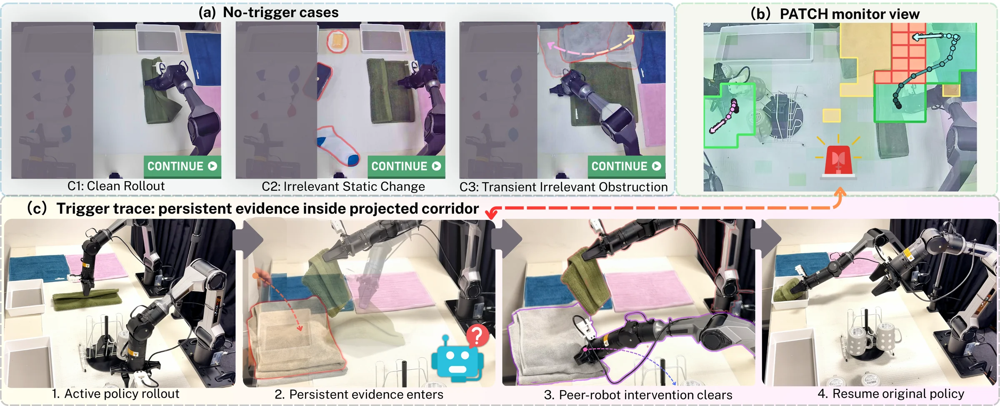
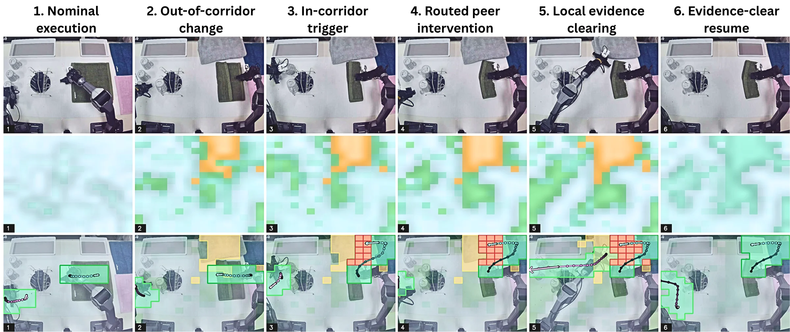

<h1 align="center">PATCH</h1>

<h3 align="center">
Action-Chunk-Conditioned Latent Patch Innovation Monitoring for Robot Manipulation
</h3>

<p align="center">
  <a href="https://scholar.google.com/citations?user=5LHIpm4AAAAJ&hl=zh-CN">Yanan Zhou</a> ·
  Ranpeng Qiu ·
  Yincong Chen ·
  Jiajie Cui ·
  <a href="https://scholar.google.com/citations?user=Y6MWNsQAAAAJ&hl=en">Weiming (William) Zhi</a>
</p>

<p align="center">
  The University of Sydney
</p>

<p align="center">
  <a href="https://yananzhou5555.github.io/PATCH/">
    
  </a>
  <a href="https://yananzhou5555.github.io/PATCH/paper/PATCH-preprint.pdf">
    
  </a>
  <a href="https://youtu.be/54r9ASDzCqI">
    
  </a>
  <a href="#release-status">
    
  </a>
</p>

<p align="center">
  
</p>

## Overview

PATCH is a runtime monitoring framework for real-world robot manipulation. Given the
active action chunk, PATCH defines a projected execution corridor, predicts latent patch
evolution inside it, and accumulates persistent residuals that cannot be explained by
the robot's own motion.

The goal is not to react to every visual change. PATCH monitors unexplained changes
inside the future motion corridor, then routes execution through hold, repair, and
resume behavior when localized evidence persists.

<p align="center">
  
</p>

## Release Status

| Component | Status |
| --- | --- |
| Project page | Live |
| Paper | Preprint available |
| Main video | Live |
| Real-robot demos | Live |
| Offline test clips | Included in the project page |
| Training / inference code | Coming soon |
| Checkpoints / processed data | Coming soon |

This repository currently hosts the public project page and static assets. The research
code will be released here once it is cleaned, documented, and packaged for external use.

## Demo Videos

| Demo | Link |
| --- | --- |
| Main video | https://youtu.be/54r9ASDzCqI |
| Multi-intervention towel rollout | https://youtu.be/-JQy57wfU74 |
| Cup-rack peer intervention | https://youtu.be/n4E4J0464M0 |
| OOD execution stress | https://youtu.be/cS9K_Xb_rAg |

## Repository Layout

```text
public/
  assets/
    brand/                  PATCH logo and institution assets
    images/                 teaser, method, result, and monitor-view figures
  media/
    offline-cases/          short local clips for the offline test grid
  paper/
    PATCH-preprint.pdf      public preprint linked from the project page
src/
  App.vue                   page structure, content, and links
  styles.css                visual system and layout
```

## Run the Project Page Locally

```bash
npm install
npm run dev
```

Build for deployment:

```bash
npm run build
```

The Vite `base` is `/PATCH/` for GitHub Pages project-site deployment.

## Citation

If you find this work useful, please cite:

```bibtex
@misc{patch2026actionchunk,
  title  = {PATCH: Action-Chunk-Conditioned Latent Patch Innovation Monitoring for Robot Manipulation},
  author = {Zhou, Yanan and Qiu, Ranpeng and Chen, Yincong and Cui, Jiajie and Zhi, Weiming},
  year   = {2026},
  note   = {Preprint}
}
```

## Contact

For questions about the project, please contact Yanan Zhou.
